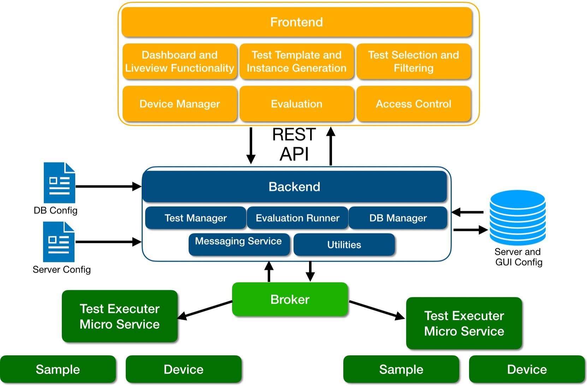

# Test Execution Hub


This repository contains the implementation of a generic test execution hub, enabling the creation of test templates, the scheduling of test instances, device discovery, filtering, and comprehensive evaluation. Initially developed for automating the execution and assessment of diverse Physical Unclonable Functions (PUFs), the platform was adjusted to support the generic execution of virtually any test type.

## Key features

- **Test template definition:** Test templates can be defined by a json description language. The framework automatically generates the corresponding database schema and GUI elements.
- **Devices mangagement:** Devices are required to execute a certain test instance. A device mangement plugin was implemented, allowing either the automatic discovery of devices in the network and a management platform for manually added devices.
- **Test scheduling**: The platform enables the scheduling of tests on instances given a certain test template.ach test instance is executed by a device listed in the device management plugin. The platform supports the simultaneous scheduling and monitoring of multiple tests, enhancing efficiency and flexibility in test execution.
- **Test result mangement**: This component allows the mangement and filtering of test results, generated by a test instance. Users can selectively choose tests, apply post-processors, utilize visualizers, and employ evaluation algorithms to the list of selected results.
- **Seamless Integration with Existing Measurement Data:** Already existing measure data can be uploaded annotated and integrated with the measurement database.
- **Data Post-processing and Visualization Capabilities:** Define post-processing, evaluation, and visualization algorithms to enable interactive assessment of measurements. This feature facilitates the exploration and analysis of results, with the ability to export them as vector graphics for further use.


## Architectural Overview

We use a generic design allowing an easy extension, replacement and maintainance of different components. In general the architecture is composed of three different layers: 
- **Frontend**: Currently implemented as a web application, the frontend allows user interaction through a single-page application (SPA).
- **Backend**: Responsible for managing the frontend's state, database access, and test execution, the backend communicates with the frontend via a REST API. It efficiently schedules tests across multiple microservices, establishing connections through the NATS messaging service.
- **Test micro service**: Multiple microservices operate as individual execution instances, enabling the independent execution of tests that the backend schedules on specific devices using a sample. In the case of memory-based PUFs, the memory module serves as the sample, connected to the device, such as a microcontroller. This modular design enhances flexibility and scalability within the system architecture.


<div align="center">
    
</div>


## How to run

To run the frontend and backend server in docker-compose execute the following command:

```bash
docker-compose up
```

The microservice is implemented as simple python implementation. Which can be executed by 

```bash
python3 start_microservice.py
```

to execute each component seperatly, please look up the [documentation](http://test-automation.florian-frank.com/) or the readme files within the [backend](https://github.com/FlorianFrank/puf_evaluation_manager), [frontend](https://github.com/FlorianFrank/puf_frontend/) or [microservice](https://github.com/FlorianFrank/puf_hub_micro_service) repositories.


## Documentation

 Further documentation can be found on [Documentation]()

## License

Unless otherwise noted, the source files are distributed under the MIT license found in the LICENSE file.

