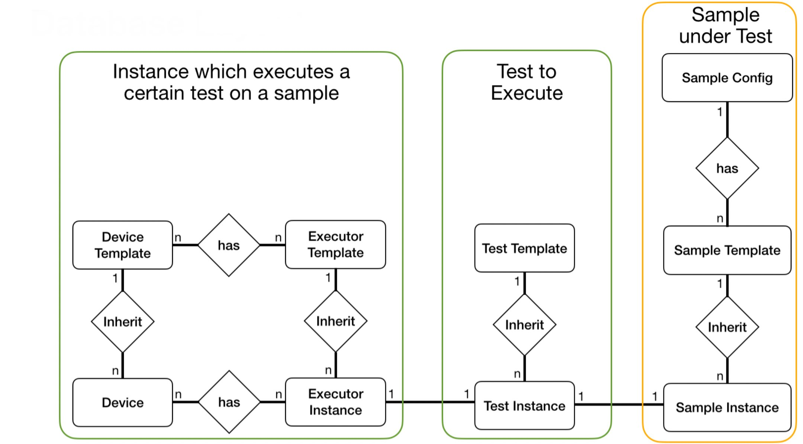
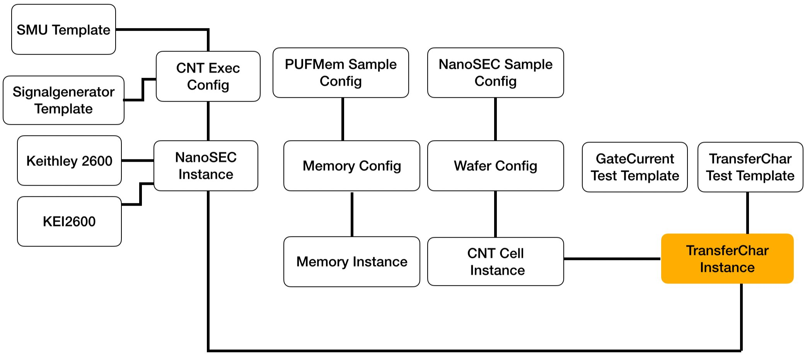

.. include:: definitions.rst

.. Test Execution Hub documentation master file, created by
   sphinx-quickstart on Wed Mar 13 20:25:51 2024.
   You can adapt this file completely to your liking, but it should at least
   contain the root `toctree` directive.

Backend
=======

This application provides the backend REST service for the `PUF
Frontend <https://github.com/FlorianFrank/puf_frontend>`__. It stores
the state of the GUI, connects to the Postgres databases storing CNT PUF
and memory PUF measurements. It additionally contains background runners
for evaluation and visualization tasks. It additionally provides
authentication functionality, a NATS client to delegate tests to
specific devices and direct access to the `Generic Test
Framework <https://github.com/FlorianFrank/generic_test_framework>`__.

Database Structure
------------------

In general, the backend implementation relies on a straightforward database schema, as illustrated in the following figure.

|br|

Test execution can be categorized into three basic groups. First, the 'sample under test' represents the component on which the test is performed. 
For instance, in the case of memory-based PUFs, the sample would be the memory module. 
The second group encompasses the definition of the test itself, specifying the parameters and conditions for its execution. For example, this includes defining row-hammering tests.
The third class describes the executing entity responsible for the execution of the test on a given sample, for example a memory controller executing a test on a specific sample.
This database schema is automatically generated from a json configuration, explained later. Also the frontend GUI is adopted dynamically to this scheme.

Each of these groups has specific tables to store their respective templates.
For instance a Sample config for a memory based PUF describes that a memory must have an address bus a data bus, etc.
Whereas the Sample template describes a memory of specific properties, e.g. a SRAM memory module of a certain manufacturer with a set of properties. 
Instances of these memory modules are stored in the 'Sample Instance' table.

This structure also applies to the 'Tests' category. Here, a 'Test Template' defines the parameters of a specific test, like a row-hammering test.
A Test Instance refers to the actual execution of a test template on a particular sample.

The definition of devices is slightly more complicated, as multiple devices may be necessary to execute a single test. For instance, conducting measurements, may require a micro-controller, 
a function generatorand an oscilloscope. These devices are defined as devices, based on a device template. All these devices are connected by a executer instance responsible, for the
execution of a test instance.

A sample configuration for a carbon-nanotube based PUF implementation can be seen in the following sample:

|br|

Automated test scheme implementation
^^^^^^^^^^^^^^^^^^^^^^^^^^^^^^^^^^^^

Within the backend it is possible to add new test categories, sample types or device classes without writing a single line of code. We provide a json definition, 
which allows the automatic generation of the database scheme, as well as a dynamic adoption of the GUI elements in the frontend. 

The config files must be added to the config folder in the backend and will be automatically discovered parsed and the database scheme and GUI adjustment will be done.

Within this folder a tests_config.json defines the different test categories: 

.. code-block:: json

   {
   "test_categories": {
      "cnt_puf": {
         "name": "Carbon Nanotube Tests",
         "folder": "cnt_puf"
      },
      "memory": {
         "name": "Memory Tests",
         "folder": "memory"
      },
      "script": {
         "name": "Script Tests",
         "folder": "script"
         }
      }
   }

To add a new test category a new entry like

.. code-block:: json

   {
   "sample_category": {
         "name": "Sample Category",
         "folder": "sample_category"
      }
   }

must be added. 

Afterwards, the following folder structure must be established according to the database configuration as shown above.

.. image:: ../../figures/backend/config_folder_structure.png
    :width: 50%
    :align: center

|br|

- The **tests** folder contains configurations for all test templates, along with optional additional tooltips for the configuration parameters.
- The **samples** folder contains all sample configuration files, defining the structure of sample instances and templates.
- The **db_model** binds to gether all configurations of a category. It specifies which sample aligns with which template, among other connections.

To introduce new test templates, a "templates" folder must be added within the designated folder of the respective test category. Inside this folder, a "tests" directory is created. 
For instance, in the case of row-hammering tests, the configuration is defined as follows:

.. code-block:: json

   {
   "start_address": 0,
   "stop_address": 1000000,
   "initialization_value": 85,
   "write_value": 170,
   "hammer_iterations": 100,
   "address_offset": 16,
   "temperature": 20,
   "humidity": 0,
   "supply_voltage": 3.3,
   "iterations": 1
   }

The backend automatically parses this config and creates the database and GUI elements. The provided values are set as default parameters. 
Furthermore, this JSON format is compatible with our comprehensive test execution framework, which will be elaborated on later.

Moreover, users have the option to append additional tooltips by including a file with identical naming within the designated tooltips folder. 
These tooltips are then displayed within the GUI, enabling supplementary descriptions of test parameters. 
For example, in the context of row-hammering tests, a "rowHammering.json" file would be added to the tooltips folder containing the following content:

.. code-block:: json

   {
   "start_address": "Start address of the memory module (maximum 32-bit, e.g., 0x00000000)",
   "stop_address": "Stop address of the memory module (maximum 32-bit, e.g., 0xffffffff). If this value exceeds the address space, the test is executed until the last address in the address space.",
   "initialization_value": "Value to write to the memory module (maximum 32-bit, e.g., 0x55555555).",
   "hammer_value": "Value written during the row-hammering operation.",
   "hammer_iterations": "Number of write iterations for each row-hammering iteration.",
   "address_offset": "When no address mapping is available, always hammer 'Address Offset' cells and evaluate the next 'Address Offset' ones.",
   "temperature": "Only applicable if a climate chamber is available.",
   "humidity": "Only applicable if a climate chamber is available.",
   "supply_voltage": "Supply voltage of the memory module. Only applicable if a power supply is connected.",
   "iterations": "Number of iterations for this test."
   }

Now we want to specify the samples on which we want to apply a certain test template. To accomplish this, we need to establish a sample folder. 
Within this folderthe sample template, as well as the definition of a sample instance is stored. Those are subdivided into two files
whreas a sample sample template for memory modules can be defined as follows:

.. code-block:: json

   {
   "type": "None",
   "manufacturer": "None",
   "model": "None",
   "start_address": 0,
   "stop_address": 0,
   "data_width": 16,
   "address_width": 32,
   "write_cycle_time": 0,
   "read_cycle_time": 0
   }

When incorporating a distinct test template, the attributes may vary significantly. 
The data type for database creation is generated automatically. **Caution:** For float fields, it's essential to specify float 
numbers, such as 0.0 instead of 0, to ensure the creation of a float field; otherwise, an integer field will be 
generated.

Furthermore, alongside the template, an instance must be included. In this example, the memroyInstance.json simply adds a reference to the template and a specific identifier. 
Further fields can be added, simultanously to the template generation.

.. code-block:: json

   {
   "template": {
      "ref": "MemoryTemplate"
   },
   "memory_id": 0
   }

Ultimately, a  configuration file must be specified combining all the configurations. 
This alows to reuse sample configurations across multiple tests, or conversely, allows various tests to utilize the same sample configurations.
The following config defines the different tables for row-hammering tests. 
The provided configuration delineates the distinct tables for row-hammering tests. Each test is identified by an 
identifier and a name, both displayed within the GUI. The GUI filter section enables the arrangement of elements 
into different groups on the GUI. For instance, fields containing addresses are automatically assigned to the 
address group, identifiers containing data are allocated to the data group, and any remaining elements are 
categorized under the "other" group.

In the following the different tables are defined. Here we can find all tables as defined in the 
figure showing the database scheme, except the device and executor tables which are generated by user 
interaction from the GUI.

.. code-block:: json

   {
      "identifier": "rowHammering",
      "name": "Row Hammering Tests",
      "category": "memory",
      "gui_filter": [
         {
            "identifier": "address",
            "name": "Address"
         },
         {
            "identifier": "value",
            "name": "Data"
         },
         {
            "identifier": "other",
            "name": "Other"
         }
      ],
      "tables": [
         {
            "db_name": "RowHammeringTemplate",
            "type": "testtemplate",
            "schema": "rowHammering.json",
            "fields": {
            }
         },
         {
            "db_name": "MemoryTemplate",
            "type": "sampleTemplate",
            "schema": "memoryTemplate.json",
            "fields": {
            }
         },
         {
            "db_name": "MemoryInstance",
            "type": "sample",
            "schema": "memoryInstance.json",
            "fields": {
            }
         }
      ]
   }

After specififying the configuration, the database scheme must be generated calling the following command:

.. code-block:: bash
   
   python3 ./utils/db_schema_generator.py

This command will add a generated folder in the test_manager app. **Caution:** Already generated models will not be overwritten, 
when modifying an already existing config, make sure you delete the corresponding python file beforehand. 
Furthermore, this will only generate the models without migrating them. The migration requires the execution of the commands: 

.. code-block:: bash
   
   python3 manage.py makemigrations
   python3 manage.py migrate

To execute all commands in one step, the following shell script can be exectued: 

.. code-block:: bash
   
   .\redo_migrations.sh

**Caution:** This command also deletes the local sqlite database, deleting all samples and templates. The database storing the 
measurement results is not touched. 

Definition of Evaluations and Visualizers
-----------------------------------------

To assess and present measurement results effectively, we require the definition of evaluators and visualizers. These components are executed by specific evaluation runners, 
which handle the requested evaluation and visualization tasks independently from the backend application, running in a separate thread. Due to the diverse parameters involved, the definition of 
visualizers cannot be accomplished through simple JSON configuration files. Matplotlib library serves as the standard tool for all visualizations.

In order to establish a seenkess interaction with the frontend and generate artifacts such as vector graphics for visualization and JSON files for evaluation results, a template class is introduced. 
Visualizers must inherit from this template class to ensure a standardized interface for execution.

TODO:
Develop a generic adapter to connect with PostgreSQL databases hosting measurement results. This adapter should operate independently from the database responsible for storing the application's state.

.. code-block:: python

   import json
   import threading
   from datetime import datetime

   from evaluation_manager.evaluation_models.general import EvaluationStatus, Visualizations
   from evaluation_manager.evaluation_runner.evaluation_handler.cnt_puf_evaluation_handler import CNTPUFEvaluator

   from config.evaluation_config import *

   class EvaluationRunner:
      """
      This class contains the functionality to  outsource visualization and post-processing tasks in dedicated threads,
      executed in the background. This allows a decoupling of computation intense visualization tasks and the main thread
      of the backend server.
      """

      def __init__(self, logger, eval_status: EvaluationStatus, visualization_type: str, visualization_properties: dict):
         """
         Initialize EvaluationRunner instance.

         Parameters:
               logger: Logger object for logging messages.
               eval_status (EvaluationStatus): Evaluation status object.
               visualization_type (str): Type of visualization.
               visualization_properties (dict): Properties for visualization.
         """
         self.logger = logger
         self.evaluation_status = eval_status
         self.visualization_type = visualization_type
         self.visualization_properties = visualization_properties
         self._visualizer_thread = threading.Thread(target=self._visualizer_thread_function, args=())
         self.output_json_objects = []
         self.output_evaluation_dict = []

      def run(self):
         """
         Starts the visualization runner thread.
         """
         self.logger.info('Start Visualization runner')
         self._visualizer_thread.daemon = True
         self._visualizer_thread.start()

      def visualize(self):
         """
         Perform visualization based on the visualization type.
         TODO: Enable dynamic extension of evaluation configuration.
         """
         cnt_fet_runner = CNTPUFEvaluator(self.logger)

         if self.visualization_type == VISUALIZATION_TYPE_RAW_FIGURE:
               self.output_evaluation_dict, self.output_json_objects = \
                  cnt_fet_runner.get_raw_evaluation_visualization_result(self.evaluation_status.id, DATABASE_NAME,
                                                                        self.visualization_properties)
         elif self.visualization_type == VISUALIZATION_TYPE_WAFER_OVERVIEW:
               self.output_evaluation_dict, self.output_json_objects = cnt_fet_runner.visualize_wafer_overview(
                  self.evaluation_status.id, DATABASE_NAME, self.visualization_properties)
               # TODO don't use these dummy values!!
               self.output_evaluation_dict = [{'id': 0, 'wafer': 2, 'row': 3, 'column': 2, 'pufID': 5,
                                             'nrSelectedCells': 144, 'nrConductiveCells': 30,
                                             'nrNonConductiveCells': 100,
                                             'nrSemiConductiveCells': 14, 'hammingWeight': 0.9}]

         return bool(self.output_evaluation_dict and self.output_json_objects)

      def _visualizer_thread_function(self):
         """
         Execution function within the visualizer thread tasked to decouple computationally intensive visualization
         from the main application.
         """
         try:
               self.logger.info('Start Visualization thread')
               self.evaluation_status.status = STATUS_RUNNING

               if self.visualize():
                  for output_json in self.output_json_objects:
                     self._save_visualization_result(output_json)
                     self.evaluation_status.status = STATUS_FINISHED
                     self.logger.info('Evaluation successful')
               else:
                  self.evaluation_status.status = STATUS_FAILED

         except Exception as e:
               self.logger.error(f'Evaluation failed: {e}')
               self.evaluation_status.status = STATUS_FAILED
         finally:
               self.logger.info('Update Evaluation object')
               self.evaluation_status.stopTime = datetime.now()
               self.evaluation_status.save()

      def _save_visualization_result(self, output_json):
         """
         Stores the visualization object in json format allowing for a seamless visualization in the frontend.
         E.g. using the d3-library.

         :param output_json: json-object representing the visualization.
         :return:None.
         """
         visualizations = Visualizations(
               evaluationStatus=self.evaluation_status,
               visualizationType=self.visualization_type,
               resultObject=json.dumps(self.output_evaluation_dict),
               json=output_json
         )
         visualizations.save()

Generic Messaging Service Endpoints
-----------------------------------

This section outlines the service-oriented architecture facilitated by the NATS framework. This framework enables seamless interaction among microservices responsible for test execution and the backend infrastructure.

In this architecture, devices communicate by subscribing to specific topics, while other devices publish relevant information on these topics. Subsequently, this information is disseminated to all subscribers within the network.

The provided interface provides the following functionalities:

 - **Device Detection:** It aids in identifying devices within the network.
 - **Test Scheduling:** Microservices utilize this interface to schedule tests efficiently.
 - **Test Execution Monitoring:** It facilitates real-time monitoring of test execution states.
 - **Live-Plot functionality:** Live data can be provided by a streaming interface, to enable visualization of meausrements during the execution, e.g. visualizing the SMU measurements.

Consequently, the interface offers the following endpoints, which must be implemented by any microservice instance to participate in the network: 

   - Topic: **schedule_test**  Payload: Concatination of the test template payload, the sample and device payload. 
    
      Example: 

            .. code-block:: json

               todo

   - Topic: **get_test_status** Payload: Porvides the test id and the current state of the execution in percentage. 

   Example: 

            .. code-block:: json

               todo

   - Topic: **get_devices**: Payload: Device info following the configuration json file. 

      Example: 

            .. code-block:: json

               todo

   - Topic: **stream_data**: Payload: Streaming data as array to be visualized at the frontend.

      Example: 

            .. code-block:: json

               todo

REST Endpoints
--------------

The app is written in python using Django as main backend framework.
Django allows us to subdivide the application into multiple apps with
different functionality:

-  .. rubric:: Authentication

   Provides the functionality required for the logging functionality,
   which is based on a token, which is passed from the frontend.

   -  It provides the following endpoints:

      -  **POST /authentication/logout** deletes the requested token and
         prevents access to all services after sending logout.

         -  **Parameters:**

            -  token: token to delete

         -  **Returns:** HTTP_205_RESET_CONTENT

-  .. rubric:: Dashboard Manager

   Provides all endpoints for widgets on the GUI dashboard

   -  It provides the following endpoints:

      -  **GET /dashboard/get_log_messages/** returns log messages from
         the backend

         -  **Parameters:**

            -  log_category: e.g. all or specific parts of the backend,
               e.g. evaluation_manager.
            -  log_type: e.g. Returns messages of a specific log type
            -  message_count: number of messages to retrieve.

         -  **Returns:**

            .. code-block:: json

               {"logMessages": [
                       "10:01:12 [Evaluation Manager] devices_view.py:34 ERROR: Receive request failed",
                       "10:01:12 [Evaluation Manager] devices_view.py:34 INFO: Receive request succeeded"]}

      -  **GET /dashboard/get_server_info/**

         -  **Returns:**

         .. code-block:: json

            {"serverinfo": [{"property": "IP", "value": "127.0.0.1"}, 
                           {"property": "Port", "value": 8000},       
                           {"property": "OS", "value": "UBUNTU LTS"}, 
                           {"property": "Online", "value": "31.12.2023 00:00"}]}

      -  **GET /dashboard/get_server_info/**

         -  **GET /dashboard/get_log_messages/** Returns memory
            consumption, cpu load and network traffic parameters from
            the backend

            -  **Returns:**

            .. code-block:: json
               
               {"current_memory_consumption": 10, "current_cpu_load": 4, "current_network_usage": 40, 
               "list_memory_consumption": [2.4, 2.8, 2.4], "list_cpu_load": [5.3,5.2, 8.5], "list_network_usage": [5.3,5.2, 8.5] }

-  .. rubric:: Device Manager

   Provides all endpoints related to the device manager, e.g. to
   identify devices or to retrieve the wafer configuration.

   -  It provides the following endpoints:

      -  **GET /devices/get_devices/** returns all devices currently
         available in the databased, which is flushed after each
         startup.

         -  **Returns:**

         .. code-block:: json

              [{"name": "NANOSEC MicroService", "idn": "", "type": "nanosec_container", "protocol": "tcp_ip",
                "port": "10.42.0.180", "status": "online", "id": 0}] 

      -  **POST /device/add_device** manually adds a device to the
         backend. Other services are automatically added by an automatic
         discovery of the nats service

         -  **Parameters:** Device specific configuration

         -  **Returns:**:

            .. code-block:: json

               {"status": "ok"}
               {"status": "error"}

      -  **GET /device/get_wafer_configs** returns the available wafer
         configurations.

         -  **Parameters:** Device specific configuration

         -  **Returns:**:

            .. code-block:: json

               [{"waferID": 2, "pufID": 23, "row": 4, "column": 4, "rowsOnPUF": [1,2,3], "columnsOnPUF": [4,3,2]}]

      -  .. rubric:: Evaluation Manager

         Provides all endpoints to run evaluations, to list the
         available evaluation and visualization results and the
         endpoints to show evaluations and visualizations.

         -  It provides the following endpoints:

            -  **GET /evaluation/get_evaluation_types** returns the
               different evaluation and visualization methods, based on
               the selected test category.

               -  **Parameters:**

                  -  testCategory: Currently the test categories
                     “cnt_puf” and “memory” are supported.

               -  **Returns:**:

                  .. code-block:: json

                     {"evaluationMethods": [{"label": "Visualization of Raw data", "value": "rawFigure"},
                                              {"label": "Quantization (2-States)", "value": "quantize_2_states"},
                                              {"label": "Quantization (3-States)", "value": "quantize_3_states"},
                                              {"label": "Wafer Visualizer", "value": "waferVisualizer"}]

            -  **GET /evaluation/get_evaluation_types** returns the
               default configuration parameters of an evaluation or
               visualization method, identified by testType.

               -  **Parameters:**

                  -  testType: Currently the test categories “cnt_puf”
                     and “memory” are supported.

               -  **Returns:**
               
                  .. code-block:: json

                     {"label": "Raw Figure", "value": "rawFigure", 
                     "properties": [{"type": "select", "label": "scale", "name": "Scale", "values": ["linear", "log", "symlog"],
                     "default": "linear"}, { "type": "select", "label": "hide_legend", "name": "Hide Legend", "values": ["true", "false"],
                     "default": "false"}, "....."]}

            -  **GET /evaluation/get_connected_measurements** returns
               all measurements connected to a certain evaluation
               object.

               -  **Parameters:**

                  -  taskID: The evaluation task which is connected to
                     certain measurements.

               -  **Returns:**

               .. code-block:: json

                    {"measurements": ["id": 0, "testType": "TransferCharacteristic", "testTitle": "Test1",
                    "wafer": 2, "row": 7, "column": 8, "pufID": 23, "rowOnPUF": 4, "columnOnPUF": 3, "temperature": 23,
                    "iterations": 5, "selectedIteration": 3]}

            -  **GET /evaluation/start_evaluation** Schedules an
               evaluation in the evaluation runner.

               -  **Parameters:** Individual parameters depending on the
                  type oe evaluation. When plotting transfer
                  characteristics:

                  -  e.g. for CNT PUF raw evaluation

                     .. code-block:: json
                     
                        {"scale": "linear", "hide_legend": "false", "legend_font_size": 20, "axis_tick_font_size": 15,
                        "axis_label_font_size": 20, "title_font_size": 20, "plot_mode": "Source Drain Current"}

               -  **Returns:**
              
                  .. code-block:: json

                     {"status": "ok"}
                     {"status": "error"}

            -  **GET /evaluation/get_status** returns the status of all
               evaluation runs.

               -  **Returns:**

                  .. code-block:: json

                     {"tasks": [{"task_id": 158, "id": 158, "title": "Test", "startTime": 1706474333358.4011, 
                     "stopTime": 1706474385709.7869, "status": "finished", "evaluationType": "waferVisualizer"}]}

            -  **DELETE /evaluation/delete_result** deletes an
               evaluation result from the database.

               -  **Parameters:**

                  -  taskID: id of the task to delete.

               -  **Results:**

                  .. code-block:: json

                     {"status": "ok"}
                     {"status": "error"}

            -  **GET /evaluation/visualizations** returns evaluation
               data and a visualization json corresponding to a certain
               taskID.

               -  **Parameters:** taskID: id to identify the chart and
                  evaluationStatus data.
               -  **Results:**

                  -  Returns a test specific chart and evaluationStatus
                     data object.

-  .. rubric:: Generic Messaging Service

   Provides all the functionality to communicate with a messaging
   service. Currently, NATS messaging service is implemented, which
   allows to discover devices and to schedule test to multiple Micro
   Service which implements the device specific interface.

   -  It provides the following endpoints:

      -  **GET /nats/start** starts the nats service and connects to the
         broker (Important: run nats-server bevore)

         -  **Returns:**:

            .. code-block:: json

               {"status": "started"}    
               {"status": "running"}
               {"status": "error"}

      -  **GET /nats/get_test_status** returns a list of all waiting,
         running or finished tests and additional data such as the test
         title, current, iteration, etc.

         -  **Parameters:**:

            -  filter: specifies the queue which filters “waiting”,
               “running” or “finished” tests.

         -  **Returns:**:

            .. code-block:: json

               {"status": "ok"}
               {"status": "error"}

      -  **POST /nats/schedule_test** schedules a test across the
         nats-broker.

         -  **Parameters:**

            -  test specifying the specification in json

         -  **Returns:**

            .. code-block:: json

               {"status": "ok"}
               {"status": "error"}

-  .. rubric:: Test Manager

   Provides models and functionality to store and filter test templates
   and instances.

   -  It provides the following endpoints:

      -  **GET /tests/get_evaluated_data** returns evaluation data
         filtered by its type and id.

         -  **Parameters:**

            -  type: defines the test category either “cnt_puf” or
               “memory” is currently supported
            -  id: Identifier of the test of a specific test category

         -  **Returns:**

            .. code-block:: json

               {"status": "ok"}
               {"status": "error"}

      -  **GET /tests/get_default_values** returns the default values of
         a “memory” or “cnt_puf” test template initiation.

         -  **Parameters:**

            -  testClass: defines the test category either “cnt_puf” or
               “memory” is currently supported.

         -  **Returns:**

            -  in case of cnt_pufs

               .. code-block:: json

                  {"title": "", "min_VDS": -1, "max_VDS": 1, "step_VDS": 0.1,
                   "min_VGS": -2.5, "max_VGS": 2.5, "step_VGS": 0.1, "test_type": "",
                   "nrIterations": 1, "pulsed": "False", "temperature": 20, "hysteresis": "False"}

      -  **GET /tests/get_test_categories** returns the different test
         categories available, e.g. memory tests, cnt, script or
         memristor tests.

         -  **Returns:**
         
            .. code-block:: json

               {"categories": [{"field": "memoryTest", "name": "Memory Test"}, {"field": "cntTest", "name": "Carbon Nanotube Test"},      
               {"field": "memristorTest", "name": "Memristor Test"}, {"field": "scriptExecution", "name": "Script Test"}]}

      -  **POST /tests/add_test** add a test template to the database,
         which can later be scheduled.

         -  **Parameters:**

            -  parameter expects a json with test template specific
               parameters, e.g. for cnt-pufs

                  .. code-block:: json

                     {
                     "title": "test", 
                      "test_type": "TransferCharacterization", 
                      "nrIterations": 2, 
                      "min_vDS": -0.5,
                      "max_VDS": 0.5
                      "..."}

         -  **Returns:**
         
           .. code-block:: json

               {"status": "ok"}
               {"status": "error"}

      -  **DELETE /tests/delete_test** deletes a test template
         identified by the test category and identifier.

         -  **Parameters:** testType: defines the test category either
            “cnt_puf” or “memory” is currently supported id: Identifier
            of the test of a specific test category
         -  **Returns:**
           
           .. code-block:: json

               {"status": "ok"}
               {"status": "error"}

      -  **GET /tests/get_tests** returns a list of test templates
         filtered by the test type.

         -  **Parameters:** testType: defines the test category either
            “cnt_puf” or “memory” is currently supported
         -  **Returns:**

            .. code-block:: json
               
                {"tests":[{"id": 1, "title": "test", "testType": "Read Latency Tests", "category": "memory", "initialValue": "0", "startAddress": 0.0,
                "stopAddress": 0.0, "voltage": 10.0, "temperature": 10.0, "dataSetupTime": "1", "createdAt": "None", "iterations": 1, "initialValue_2": "1"}]}

