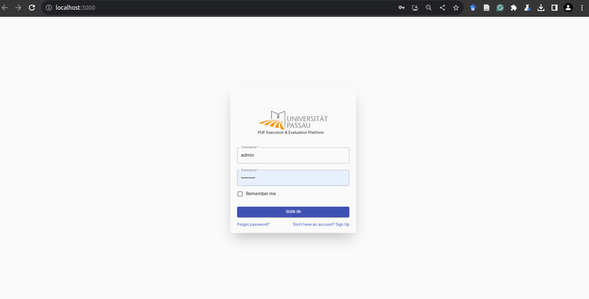
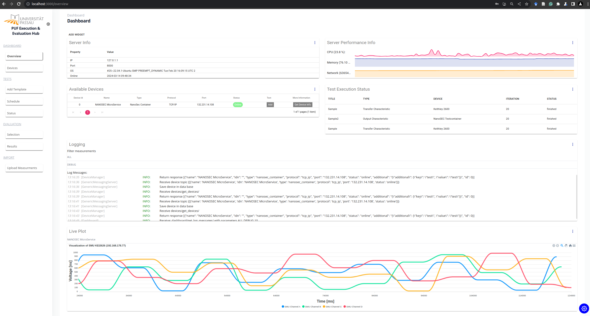

.. |br| raw:: html

    

Graphical User Interface
========================

The implementation provides a web interface implemented in `React <https://react.dev/>`_ utilizing `Material UI <https://mui.com/>`_ components. 
To install the packages manually the tools yarn or npm can be used. We recomment to use yarn to to its parallel installation and overall better performance. 

Setup
-----

First nodejs and npm needs to be installed to build the application 

.. code-block:: bash

    sudo apt-get install nodejs npm

when using yarn as a build tool, execute the following command:

.. code-block:: bash

    npm install --global yarn

To install the required packages, the following command must be executed directly in the test_hub_frontend:

.. code-block:: bash

    yarn

After installing all packages in the node_modules folder, the gui can be started by the following command 

.. code-block:: bash

    yarn start

GUI Elements
------------

After compiling the web application, the graphical user interface is accessable by `localhost:3000 <https://localhost:8000/>`_.
If no current user session is running, the logging page is shown.

|br|

If no user is created refer to `Backend <https://localhost:8000/>`_
Currently the dialog to register new users is not implemented and needs to be done manually in the test execution backend.

Dashboard
^^^^^^^^^

After the logging the dashboard is visualized showing general information, like the connected devices. the currently scheduled tests, logging messages and performance information to 
monitor the backend or the visualization of live data, e.g. when measurement devices like SMUs or oscilloscopes are connected. The dashboard is organized as grid with three rows, and 
can be customized by adding or deleting certain widgets.

|br|